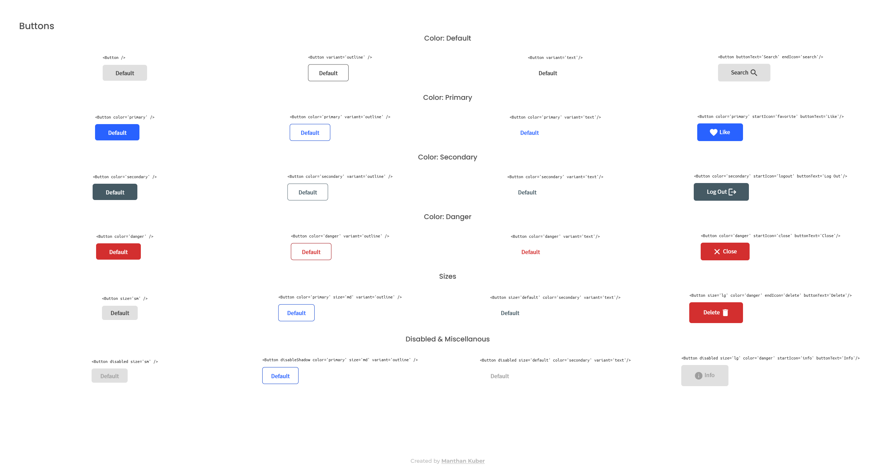

<!-- Please update value in the {}  -->

<h1 align="center">Button Component Library</h1>

   A React Button Component Library.Solution for a challenge from  <a href="http://devchallenges.io" target="_blank">Devchallenges.io</a>.

  <h3>
    <a href="#">
      Live Demo
    </a>
     | 
    <a href="https://devchallenges.io/challenges/ohgVTyJCbm5OZyTB2gNY">
      Challenge
    </a>
  </h3>

<!-- TABLE OF CONTENTS -->

## Table of Contents

- [Overview](#overview)
- [Learnings](#learnings)
- [Contact](#contact)

<!-- OVERVIEW -->

## Overview

Desktop Screenshot

Mobile Screenshot

This application/site was created as a submission to a [DevChallenges](https://devchallenges.io/challenges) challenge. The [challenge](https://devchallenges.io/challenges/OEKdUZ6xs0h99C38XVht) was to build an application to complete the given user stories.

### Built With

<!-- This section should list any major frameworks that you built your project using. Here are a few examples.-->

- [React](https://reactjs.org/)
- [StyledComponents](https://styled-components.com/)

## Learnings

- Learned about Styled Components
- Improved React Logic
- Improved 

## Contact

- GitHub [@Manthan-Kuber](https://github.com/Manthan-Kuber)
